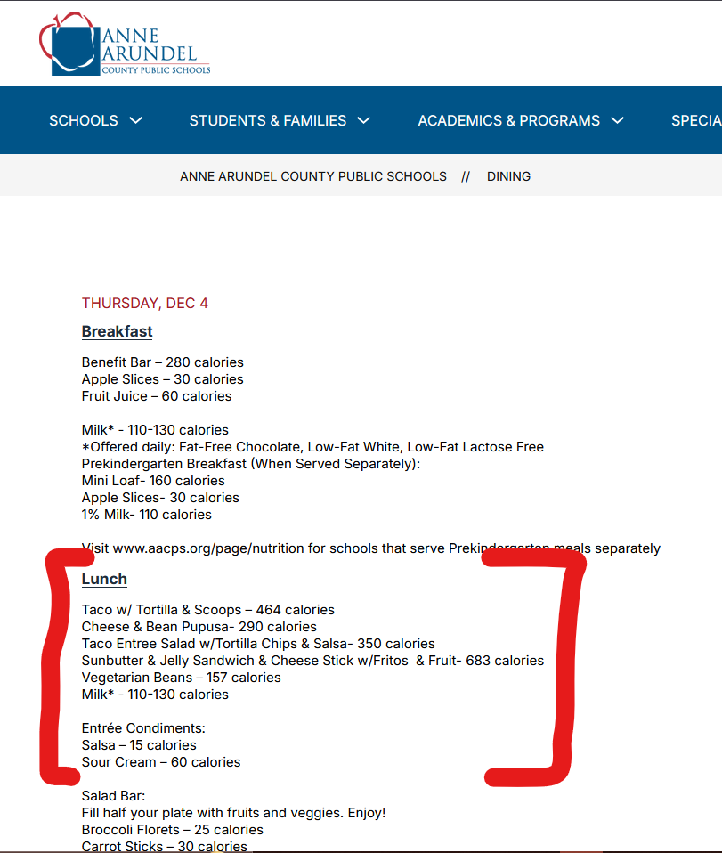
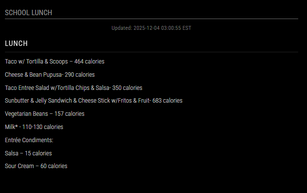

# MMM-LunchMenu

A MagicMirror² module that displays lunch menu information scraped from web sources such as county school dining/food schedule pages. This module works with an external Docker-based scraper service that fetches menu data from websites and generates formatted HTML for display.

> **Developer's Note:** This project arose from a want to display the next day's lunch menu for our school district on our MagicMirror². Unfortunately our county's school menu site did not support iframes, and could not be dynamically linked to for parsing normally. This setup uses BeautifulSoup to render the page within a browser via Python, where it can then be parsed for the info. Once extracted, the container will use that saved information to create a simple HTML setup for the module to display. The setup reloads and scrapes at 3AM EST, since the link I used in my setup changes daily. Customize it for your needs based on the type of info and page you'll be using.

## Features

- **Automatic Menu Scraping**: Docker container automatically scrapes menu data on a schedule
- **Weekend Handling**: Automatically shows Monday's menu on weekends (configurable)
- **Customizable**: Easy to configure for different websites and menu formats
- **Lightweight**: Uses simple HTTP requests (no browser automation needed)
- **Beautiful Display**: Clean HTML output styled for MagicMirror²

## Screenshots

 → 

The scraper captures the marked lunch section from the website (left) and displays it in the Magic Mirror module (right).

## Installation

### 1. Install the Module

In your MagicMirror² `modules` directory:

```bash
cd ~/MagicMirror/modules
git clone https://github.com/mjryan253/mmm-lunchmenu.git MMM-LunchMenu
cd MMM-LunchMenu
```

### 2. Set Up the Scraper Service

The module requires a separate scraper service to fetch menu data. You can run this in a Docker container or as a standalone Python script.

#### Option A: Using Docker (Recommended)

1. Copy the example Docker Compose file:
```bash
cd scraper
cp docker-compose.example.yml docker-compose.yml
```

2. Edit `docker-compose.yml` and configure the environment variables (see Configuration section below)

3. Start the scraper:
```bash
docker-compose up -d
```

#### Option B: Standalone Python Script

1. Install Python dependencies:
```bash
cd scraper
pip install -r requirements.txt
```

2. Set environment variables and run:
```bash
export MENU_URL="https://your-menu-website.com"
export OUTPUT_PATH="./lunch_menu.html"
python scrape.py
```

### 3. Configure MagicMirror

Add the module to your `config/config.js`:

```javascript
{
    module: 'MMM-LunchMenu',
    position: 'bottom_left',
    header: 'School Lunch',
    config: {
        menuUrl: '/modules/MMM-LunchMenu/public/lunch_menu.html',
        updateInterval: 3600000, // 1 hour in milliseconds
        width: '600px',
        height: '400px'
    }
}
```

**Important**: The `menuUrl` path must match where the scraper outputs the HTML file. If using Docker, ensure the volume mount points to the correct location.

## Configuration

### Module Configuration Options

| Option | Type | Default | Description |
|--------|------|---------|-------------|
| `menuUrl` | string | `/modules/MMM-LunchMenu/public/lunch_menu.html` | Path to the generated menu HTML file (must be accessible by MagicMirror) |
| `updateInterval` | number | `3600000` | How often to refresh the menu (in milliseconds) |
| `width` | string | `"600px"` | Width of the module display |
| `height` | string | `"400px"` | Height of the module display |

### Scraper Configuration (Environment Variables)

The scraper can be configured using environment variables. These can be set in your `docker-compose.yml` file or as system environment variables.

#### Required

- **`MENU_URL`**: The URL of the website to scrape for menu information
  - Example: `https://www.aacps.org/dining?filter=61292`

#### Optional

- **`OUTPUT_PATH`**: Path where the HTML file will be saved (default: `/output/lunch_menu.html`)
- **`TIMEZONE`**: Timezone for date calculations (default: `America/New_York`)
  - Examples: `America/New_York`, `Europe/London`, `America/Los_Angeles`
- **`SCHEDULE_TIME`**: Time to run daily scrape in 24-hour format (default: `03:00`)
  - Example: `03:00` for 3:00 AM, `14:30` for 2:30 PM
- **`WEEKEND_FALLBACK`**: Show Monday's menu on weekends (default: `true`)
  - Set to `false` to disable weekend fallback
- **`TARGET_DAY_PATTERN`**: Regex pattern to match day names in the menu (default: `(Monday|Tuesday|Wednesday|Thursday|Friday|Saturday|Sunday)`)
  - Customize if your website uses different day names or formats
- **`MENU_SECTION_PATTERN`**: Regex pattern to extract the menu section (default: `Lunch(.*?)(?=salad bar|$)`)
  - This pattern captures content after "Lunch" until "salad bar" or end of text
  - Customize based on your website's menu structure
- **`MENU_SECTION_NAME`**: Display name for the menu section (default: `Lunch`)
  - This is the header text shown in the module

## Customization Guide

### Customizing for Your Website

To adapt this module for a different website, you'll need to customize the scraper's parsing logic. Here's a step-by-step guide:

#### Step 1: Inspect Your Website

1. Open your menu website in a browser
2. Right-click and select "View Page Source" or use browser DevTools
3. Identify how the menu data is structured:
   - How are days of the week labeled?
   - Where is the menu content located in the HTML?
   - What text patterns indicate the start/end of menu sections?

#### Step 2: Test the URL

First, verify the scraper can fetch your website:

```bash
# Using curl to test
curl -H "User-Agent: Mozilla/5.0" https://your-menu-website.com
```

If the website requires JavaScript to load content, you may need to use a different approach (like Playwright or Selenium) instead of the simple `requests` library.

#### Step 3: Customize the Regex Patterns

The scraper uses regex patterns to extract menu information. You'll likely need to adjust:

1. **`TARGET_DAY_PATTERN`**: Match how days are labeled on your website
   ```python
   # Example: If your site uses "Mon", "Tue", etc.
   TARGET_DAY_PATTERN = r'(Mon|Tue|Wed|Thu|Fri|Sat|Sun)'
   
   # Example: If your site uses dates like "12/03/2025"
   TARGET_DAY_PATTERN = r'(\d{1,2}/\d{1,2}/\d{4})'
   ```

2. **`MENU_SECTION_PATTERN`**: Extract the menu content
   ```python
   # Example: Extract everything after "Lunch Menu:" until next section
   MENU_SECTION_PATTERN = r'Lunch Menu:\s*(.*?)(?=Breakfast|Dinner|$)'
   
   # Example: Extract content between specific HTML tags
   # (You might need to modify parse_menu_content() function for this)
   ```

#### Step 4: Modify the Parsing Function (If Needed)

If your website has a complex structure, you may need to modify the `parse_menu_content()` function in `scraper/scrape.py`. For example:

```python
def parse_menu_content(html_content):
    """Custom parsing for your specific website."""
    soup = BeautifulSoup(html_content, 'html.parser')
    
    # Example: Find menu by CSS selector
    menu_div = soup.find('div', class_='menu-content')
    if not menu_div:
        return None
    
    # Extract text or specific elements
    menu_items = menu_div.find_all('li')
    menu_text = '\n'.join([item.get_text() for item in menu_items])
    
    return [('Lunch', menu_text)]
```

#### Step 5: Test Your Configuration

1. Set environment variables:
```bash
export MENU_URL="https://your-menu-website.com"
export MENU_SECTION_PATTERN="your-custom-pattern"
```

2. Run the scraper manually:
```bash
cd scraper
python scrape.py
```

3. Check the output file to verify it contains the correct menu data

4. If the output looks correct, update your `docker-compose.yml` with the new environment variables

#### Step 6: Adjust HTML Styling (Optional)

The `generate_html_output()` function in `scrape.py` creates the HTML display. You can customize the CSS styles to match your preferences:

```python
# In generate_html_output() function, modify the html_template
# Change colors, fonts, spacing, etc. to match your MagicMirror theme
```

### Example: Customizing for a Different School District

Let's say you want to scrape a menu from a different school district website:

1. **Find the menu URL**: Navigate to the school's menu page and copy the URL
2. **Inspect the HTML structure**: Look at how the menu is formatted
3. **Update docker-compose.yml**:
```yaml
environment:
  - MENU_URL=https://newschool.example.com/menus
  - MENU_SECTION_PATTERN=Lunch Menu\s*(.*?)(?=Nutrition|$)
  - MENU_SECTION_NAME=Today's Lunch
```

4. **Test and iterate**: Run the scraper and adjust patterns until it extracts the correct data

### Advanced Customization

#### Multiple Menu Sections

To extract multiple sections (e.g., Breakfast and Lunch), modify `parse_menu_content()`:

```python
menu_sections = []

# Extract Breakfast
breakfast_match = re.search(r'Breakfast(.*?)(?=Lunch|$)', today_menu, re.DOTALL | re.IGNORECASE)
if breakfast_match:
    menu_sections.append(('Breakfast', breakfast_match.group(1).strip()))

# Extract Lunch
lunch_match = re.search(r'Lunch(.*?)(?=Dinner|$)', today_menu, re.DOTALL | re.IGNORECASE)
if lunch_match:
    menu_sections.append(('Lunch', lunch_match.group(1).strip()))

return menu_sections
```

#### Different Timezone Handling

If your menu website uses a different timezone:

```yaml
environment:
  - TIMEZONE=America/Chicago  # Central Time
  - SCHEDULE_TIME=02:00  # Run at 2 AM Central
```

#### Custom Weekend Behavior

To show a different day's menu on weekends:

Modify the `parse_menu_content()` function:
```python
if WEEKEND_FALLBACK and day_of_week >= 5:
    target_date_str = "Friday"  # Show Friday's menu on weekends
```

## Docker Setup

### Using Docker Compose (Recommended)

1. Create `scraper/docker-compose.yml`:
```yaml
version: '3.8'

services:
  menu-scraper:
    build: .
    container_name: mmm-lunchmenu-scraper
    restart: unless-stopped
    environment:
      - MENU_URL=https://your-menu-website.com
      - OUTPUT_PATH=/output/lunch_menu.html
      - TIMEZONE=America/New_York
      - SCHEDULE_TIME=03:00
    volumes:
      - ./output:/output
```

2. Build and start:
```bash
cd scraper
docker-compose up -d
```

### Integrating with MagicMirror Docker Setup

If you're running MagicMirror in Docker, you can integrate the scraper:

```yaml
services:
  magicmirror:
    # ... your MagicMirror config ...
    volumes:
      - ./config:/opt/magic_mirror/config
      - mm2_shared:/opt/magic_mirror/modules/MMM-LunchMenu/public
  
  menu-scraper:
    build: ./scraper
    volumes:
      - mm2_shared:/output  # Shared volume with MagicMirror
    environment:
      - MENU_URL=https://your-menu-website.com
      - OUTPUT_PATH=/output/lunch_menu.html

volumes:
  mm2_shared:
```

Then update your MagicMirror config:
```javascript
{
    module: 'MMM-LunchMenu',
    config: {
        menuUrl: '/modules/MMM-LunchMenu/public/lunch_menu.html'
    }
}
```

## Troubleshooting

### Menu Not Displaying

1. **Check scraper logs**:
```bash
docker-compose logs menu-scraper
```

2. **Verify HTML file exists**:
```bash
# If using Docker
docker-compose exec menu-scraper ls -la /output/

# If using standalone
ls -la scraper/output/
```

3. **Check file permissions**: Ensure MagicMirror can read the HTML file

4. **Verify menuUrl path**: The path in `config.js` must match where the file is actually located

### Scraper Not Fetching Data

1. **Test the URL manually**:
```bash
curl -H "User-Agent: Mozilla/5.0" https://your-menu-website.com
```

2. **Check if website requires JavaScript**: Some sites need browser automation (Playwright/Selenium)

3. **Verify regex patterns**: The patterns might not match your website's structure

4. **Check timezone settings**: Ensure the timezone matches your location

### Parsing Errors

1. **Inspect the raw HTML**: Save the fetched HTML and examine its structure
2. **Adjust regex patterns**: Modify `TARGET_DAY_PATTERN` and `MENU_SECTION_PATTERN`
3. **Modify parsing function**: For complex structures, customize `parse_menu_content()`

### Permission Errors

If you see permission errors:

```bash
# Fix output directory permissions
chmod 777 scraper/output/

# Or recreate Docker volume
docker-compose down
docker volume rm [volume-name]
docker-compose up -d
```

## Development

### Running Locally

1. Install dependencies:
```bash
cd scraper
pip install -r requirements.txt
```

2. Set environment variables:
```bash
export MENU_URL="https://your-menu-website.com"
export OUTPUT_PATH="./lunch_menu.html"
```

3. Run:
```bash
python scrape.py
```

### Testing Changes

1. Modify `scrape.py` with your changes
2. Test locally before updating Docker image
3. Check the generated HTML file for correctness
4. Rebuild Docker image if needed:
```bash
docker-compose build --no-cache
```

## License

MIT License - see [LICENSE.md](LICENSE.md) for details

## Contributing

Contributions are welcome! Please feel free to submit a Pull Request.

## Acknowledgments

- Based on the [MMM-Template](https://github.com/Dennis-Rosenbaum/MMM-Template) by Dennis Rosenbaum
- Uses [BeautifulSoup4](https://www.crummy.com/software/BeautifulSoup/) for HTML parsing
- Uses [requests](https://requests.readthedocs.io/) for HTTP requests

## Support

For issues and questions:
1. Check the troubleshooting section above
2. Review the customization guide
3. Open an issue on GitHub with:
   - Your website URL (if not sensitive)
   - Error messages from logs
   - Your configuration (sanitized)

